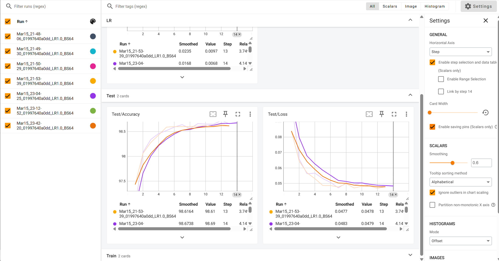

# Introduction

动手实现“新的张量运算”，任务分为两个：
- Pytorch 平台中，基于 Python API 实现张量运算。
- Pytorch 平台中，基于 C++ API 实现张量运算。
# Startup
下载lab所需文件，课程沿用github Microsoft的ai system代码仓库。点击链接下载：[AI-System/Labs/BasicLabs/Lab2 at main · microsoft/AI-System]

项目目录修改成：
```bash
|-- MNIST
|   |-- processed
|   `-- raw
|-- mnist_basic.py
|-- mnist_custom_linear.py   示例Python API 实现张量运算
|-- myconv.py 自己编写的conv算子 python API
|-- mnist_custom_linear_conv_cpp.py  原有的mnist_custom_linear_cpp.py改编而成
|-- myconv_extension
|   |-- build   自动生成
|   |-- dist   自动生成
|   |-- myconv.cpp    自己编写的 cpp API算子
|   |-- myconv_cpp.egg-info   自动生成
|   `-- setup.py   搬运 mylinear_cpp_extension/setup.py 并修改
`-- mylinear_cpp_extension
    |-- mylinear.cpp  原有参考资料
    `-- setup.py
```
# setup
首先进入虚拟环境 `conda activate <yourenv>`

`myconv.py`和`mnist_custom_linear_conv_cpp.py`中要修改关于MNIST数据集的两个地方：`'../../../siton-data-f436217d67d348d18923c6c0952cbaf0/lbx/MNIST'`，修改成你的MNIST数据集路径。
## CPP API

```bash 
 cd myconv_extension
 python setup.py install --user
 cd ..
 cd mylinear_cpp_extension
 python setup.py install --user
 cd ..
 python mnist_custom_linear_conv_cpp.py  运行cpp编写而成的示例 
```
## python API
终端输入：
```
python myconv.py --epochs=num --linear-type=function
```
num为数字，linear-type 可以填function和native 填function则运行自定义conv ，native则运行torch自带的conv类。

# tensorboard
可以先退出本ssh会话，再通过`ssh -L 6006:localhost:6006 username@remote_server_ip -p yourport`进行会话设置，也可以使用另一个终端进行ssh链接，并进行端口转发设置

使用tensorboard进行转发， 本代码的`log`存储在run下：
```bash
tensorboard --logdir=runs --port=6006
```
打开浏览器，访问`localhost:6006`即可看到`tensorboard`：
