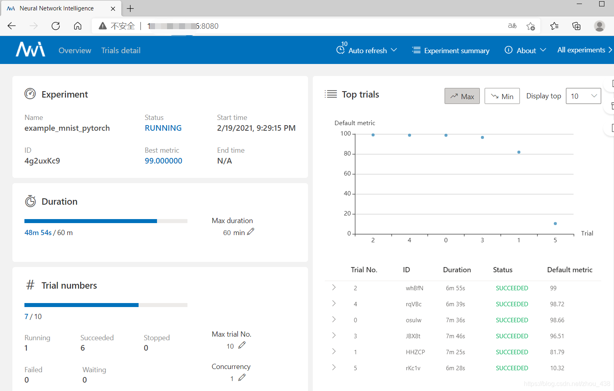

# NNI实验报告
什么是NNI？

**NNI** (Neural Network Intelligence) 是自动机器学习（AutoML）的工具包。它通过多种调优的算法来搜索最好的神经网络结构和（或）超参，并支持单机、本地多机、云等不同的运行环境。 一个朴素的想法是：在有限的时间内，NNI测试一定量的超参，返回给你最优的参数组合。

因此本仓库项目实现了一个基于 PyTorch 的 MNIST 手写数字识别任务。
## 硬件设备
### CPU型号以及核数
```bash
Model name:                           Intel(R) Xeon(R) Gold 6226R CPU @ 2.90GHz
Thread(s) per core:                   2
Core(s) per socket:                   16
Socket(s):                            2
```
### GPU型号以及数目
NVIDIA GeForce RTX 3090 × 8 
## 软件设备
OS:`ubuntu 22.04 LTS jammy` 

内核版本：`6.8.0-52-generic`

`pytorch`: 1.12.0+cu113

`Cuda`: 12.6  
## 使用方法

```bash
chmod 777 train.sh NNI_modified.py Original.py config.yaml search_space.json
./train.sh
```
在train.sh中修改参数即可。本代码只暴露出 `batch_size hidden_size lr epochs`供大家调参，如需添加请自行修改。

### NNI使用
在实验开始前或者实验ERROR时，可以先试试`nnictl stop all`，即停止正在进行的所有实验。

接着，~~重新~~启动一个实验：`nnictl create --config config.yaml`，出现下列信息
```bash
[2025-04-01 16:13:54] Creating experiment, Experiment ID: q3lgnozw
[2025-04-01 16:13:54] Starting web server...
[2025-04-01 16:13:56] WARNING: Timeout, retry...
[2025-04-01 16:13:57] Setting up...
[2025-04-01 16:13:57] Web portal URLs: http://127.0.0.1:8080 http://10.184.17.118:8080  # important
[2025-04-01 16:13:57] To stop experiment run "nnictl stop q3lgnozw" or "nnictl stop --all"
[2025-04-01 16:13:57] Reference: https://nni.readthedocs.io/en/stable/reference/nnictl.html
```
你可以通过浏览器访问 http://127.0.0.1:8080 或 http://10.184.17.118:8080 查看实验进度。

127.0.0.1 是本机地址，仅限当前机器访问。 10.184.17.118 是局域网地址，可能可以在局域网内的其他设备上访问。
```bash
 nnictl experiment list  # 查看正在进行的实验编号
```

训练示意图：

## 实验结果分析

| 方法   | 超参数名称和数值                                                 | 模型准确率  | 耗时   | 备注(如NNI的配置)                                                                               |
|------|----------------------------------------------------------|--------|------|-------------------------------------------------------------------------------------------|
| 手动调参 | batch_size  = 64   hidden_size = 512 <br/>  lr = 0.01 epochs = 10 | 99.52% | 110s | NULL                                                                                      |
| 手动调参 | batch_size  = 32   hidden_size = 512 <br/>lr= 2e-5   epochs = 10 | 90.03% | 151s | NULL                                                                                      |
| 手动调参 | batch_size  = 32   hidden_size = 1024 <br/>lr= 2e-5   epochs = 10 | 91.66% | 149s | NULL                                                                                      |
| 手动调参 | batch_size  = 64  hidden_size = 1024 <br/>lr= 2e-5   epochs = 10 | 75.65% | 116s | NULL                                                                                      |
| NNI 自动调参 | batch_size  = 64  hidden_size = 1024 <br/>lr= 2e-5   epochs = 10 | 77.39% | 112s | batch_size=[16, 32, 64, 128]  hidden_size=[128, 256, 512, 1024]  lr=[0.0001, 0.001, 0.01, 0.1] |
| NNI 自动调参 | batch_size=64, hidden_size=512, lr=0.01, epochs=10       | 99.52% | 111s | 与手动调参结果相同，验证了 NNI 的有效性  |
| NNI 自动调参 | batch_size=128, hidden_size=256, lr=0.001, epochs=10 | 98.76%  | 105s | NNI 自动搜索得到的较优结果    |
| NNI 自动调参 | batch_size=32, hidden_size=128, lr=0.0001, epochs=10                       | 92.34%  |150s | NNI 自动搜索得到的结果，表现一般     |
| NNI 自动调参 | batch_size=16, hidden_size=1024, lr=0.1, epochs=10         | 88.45% | 160s| 学习率过高导致训练不稳定                    |

### 实验NNI web界面
