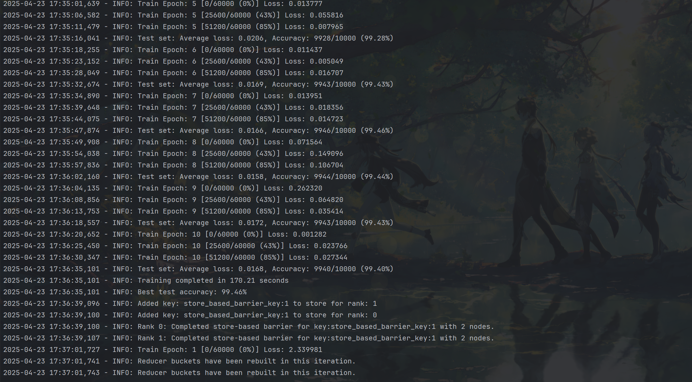

# 分布式训练MNIST实验

## 硬件设备
### CPU型号以及核数
```bash
Model name:                           Intel(R) Xeon(R) Gold 6226R CPU @ 2.90GHz
Thread(s) per core:                   2
Core(s) per socket:                   16
Socket(s):                            2
```
### GPU型号以及数目
NVIDIA GeForce RTX 3090 × 8 
## 软件设备
OS:`ubuntu 22.04 LTS jammy` 

内核版本：`6.8.0-52-generic`

`pytorch`: 1.12.0+cu113

`Cuda`: 12.6  

## 实验
### DDP 的核心思想
- 数据并行化：将训练数据划分成多个子集（分片），每个 GPU 处理不同的数据分片。
- 模型复制：每个 GPU 上复制完整的模型副本。
- 梯度同步：所有 GPU 计算完梯度后，通过高效的通信协议（如 NCCL）同步梯度。
- 参数一致性：每个 GPU 使用同步后的梯度更新本地模型，确保所有模型副本参数一致。
### 代码样例
`./start.sh`即可启动实验，代码中`DistributedSampler`被设置为`train_sampler`的`attribute`，在`trainloader`中被调用，`test_sampler`也是一样。

#### 单机多GPU
在`main.py`中，采用`model = DDP(model, device_ids=[rank])`进行模型**多GPU并行**。
```bash
mp.spawn(
    ddp_worker,
    args=(num_procs, args_dict),
    nprocs=num_procs,
    join=True
)
```
每个 GPU 启动一个进程（nprocs=num_procs），ddp_worker(rank, world_size, args) 会调用 dist.init_process_group 来初始化通信后台。
#### 数据并行
分布式采样：
```python
    # 分布式采样器
    train_sampler = DistributedSampler(
        train_dataset,
        num_replicas=world_size,
        rank=rank,
        shuffle=True
    )
    test_sampler = DistributedSampler(
        test_dataset,
        num_replicas=world_size,
        rank=rank,
        shuffle=False
    )
```
DistributedSampler 会把整个数据集按进程（即按 GPU）划分，保证每个进程读到不同的 batch 子集。
## 实验表格
实验截图：


本次实验采用`epoch = 10 batch_size = 64`，目前支持`NCCL Gloo`两种后端通信方式。
`NNCL`是GPU之间点对点通信的优化库。

| 设备数量 | 通信后端 | 单机 GPU 数量 | 耗时      | 加速比 | Test Accuracy |
|--------|--------|-----------|---------|-------|---------------|
| 1      | NCCL   | 1         | 200.97s | 1.00  | 99.56%        |
| 1      | NCCL   | 2         | 117.07s | 1.67  | 99.43%        |
| 1      | NCCL   | 4         | 170.21s | 2.22  | 99.46%        |
| 1      | NCCL   | 8         | 228.03s | 2.86  | 99.37%        |
| 1      | Gloo   | 8         | 126.65s | 0.83  | 99.34%        |
| 1      | Gloo   | 2         | 128.20s | 1.25  | 99.49%        | 
| 1      | Gloo   | 1         | 331.55s | 1.25  | 99.55%        |

## 后记

`DDP`与`DP(DataParallel)`的区别是？

- `nn.DataParallel(model)`中，`torch`同一个进程中把模型复制进入所有GPU,每个GPU独自地做前向和反向。主卡把输入切分的batch拷贝到各个卡。每个卡做完前向和反向后将梯度通过PCle，copy到主卡，在主卡上进行相加。即主卡得到全局的梯度做一次`optimizer.step()`之后广播给其各个卡。
- `DDP`是每一个GPU启动一个进程，各自持有模型副本。各自进行前向反向，得到本地梯度后，在 NCCL 的优化通道里并行地把各卡梯度求和，然后把「和」直接留存在每张卡上。通信是对等的、分散的、并行的，带宽利用率更好、扩展性更强。